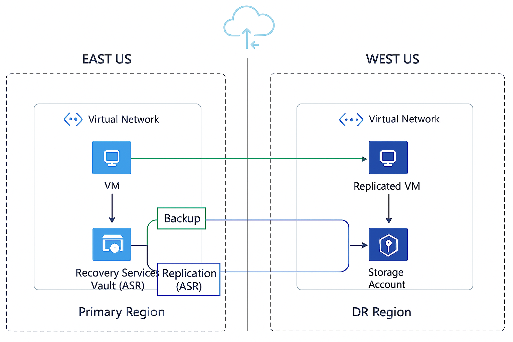

# 2-Tier DR Solution on Azure with Terraform

This project provisions a 2-tier Disaster Recovery (DR) solution on Azure using Terraform. It automates the deployment of resource groups, storage accounts, virtual networks, and virtual machines across multiple regions for high availability and disaster recovery.

## Features

- Multi-region deployment using a region map
- Resource groups and storage accounts per region
- Virtual network and subnet creation via modules
- Primary and DR virtual machines with custom initialization
- Tagging and naming conventions for all resources


## Structure

- `Infra/` - Main Terraform code
    - `main.tf` - Core resources and modules
    - `variables.tf` - Input variables
    - `outputs.tf` - Output values
    - `providers.tf` - Provider configuration
    - `locals.tf` - Local values and region mapping
    - `terraform.tfvars` - Variable values
    - `modules/` - Reusable modules for network and VM

## Usage

1. Clone the repository.
2. Update `terraform.tfvars` with your desired values.
3. Initialize Terraform:
     ```sh
     terraform init
     ```
4. Plan the deployment:
     ```sh
     terraform plan
     ```
5. Apply the configuration:
     ```sh
     terraform apply
     ```

## Requirements

- Terraform v1.0+
- Azure CLI authenticated

## Customization

- Edit `variables.tf` and `terraform.tfvars` to change regions, VM sizes, and other parameters.
- Modules can be extended for additional resources.

## License

MIT License
- Resource groups and storage accounts per region
- Virtual network and subnet creation via modules
- Primary and DR virtual machines with custom initialization
- Tagging and naming conventions for all resources

## Structure

- `Infra/` - Main Terraform code
  - `main.tf` - Core resources and modules
  - `variables.tf` - Input variables
  - `outputs.tf` - Output values
  - `providers.tf` - Provider configuration
  - `locals.tf` - Local values and region mapping
  - `terraform.tfvars` - Variable values
  - `modules/` - Reusable modules for network and VM

## Usage

1. Clone the repository.
2. Update `terraform.tfvars` with your desired values.
3. Initialize Terraform:
   ```sh
   terraform init
   ```
4. Plan the deployment:
   ```sh
   terraform plan
   ```
5. Apply the configuration:
   ```sh
   terraform apply
   ```

## Requirements

- Terraform v1.0+
- Azure CLI authenticated

## Customization

- Edit `variables.tf` and `terraform.tfvars` to change regions, VM sizes, and other parameters.
- Modules can be extended for additional resources.

## License

MIT License